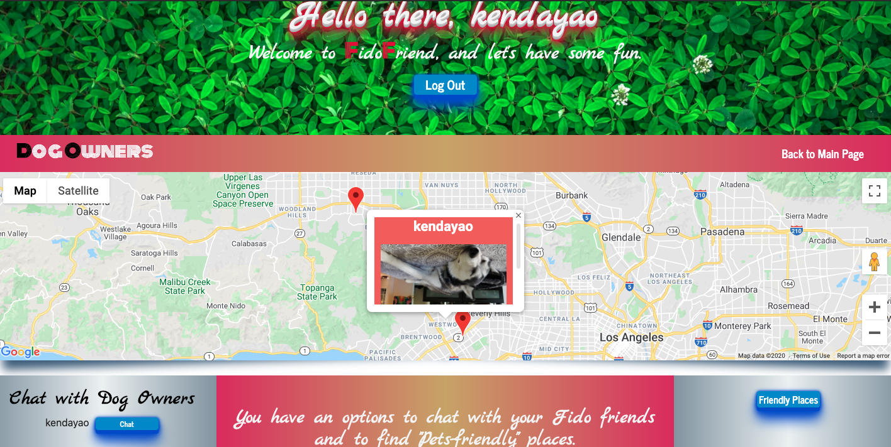

# FidoFriend

## Description

FidoFriend is a responsive web application to connect dog owners with each other. Dog owners can see other dog owners around their local area and have the ability to message each other via a chat feature. It also helps people find dog friendly locations near them based on location inputted. This portfolio was built with REACT and a few other languages, see below for a complete list. Enjoy!

## Table of Contents

* [Description](#description)
* [User Story](#user-story)
* [Installation](#installation)
* [Usage](#usage)
* [License](#license)
* [Contributing](#contributing)
* [Technologies](#technologies)
* [Tests](#tests)
* [Questions](#questions)
* [Deployed Application URL](#deployed-application-URL)

## User Story

As dog owners, we wanted to connect with dog owners around each of our areas. We also wanted to find places where we can hang out and socialize with our dogs. Our application also makes it possible to find other dog owners who are willing to dogsit.

## Installation

No installation needed. If cloning repo do an npm install.

## Usage

You may use the credentials below to log in:

username: cool_coder
password: 12341234

## License

## Contributing

Kaeneth Dayao - https://github.com/kendayao

Alex Jeong - https://github.com/seongwoj

JC Mastropieri - https://github.com/jcmastropieri

William Grundler - https://github.com/wrg93

Oleksandr Prykotenko - https://github.com/prikat

## Technologies
- CSS
- React
- HTML
- Heroku
- Node
- REDUX
- Bootstrap
- Express
- MongoDB/Mongoose
- Google API
- Yelp API
- The Dog API
- Socket.io

## Tests

No tests to run.

## Questions

For any questions, please contact one of the following: 

kendayao at kendayao@gmail.com

wrgrundler at wrgrundler@gmail.com

seongwoojeong at seongwoojeong@gmail.com

aprykotenko at aprykotenko@gmail.com

jcmastro5 at jcmastro5@gmail.com

## Deployed Application URL

Deployed application link: https://fidofriendproject.herokuapp.com/

Video Demo: https://giphy.com/gifs/h20bw5D8JgLoOLcIQs/fullscreen

